# Operation Guide

Everything you do with the device day to day. For assembly and first boot see the [setup guide](setup_guide.md), for the wire protocol see the [specification](cardano_seedsigner_air_gapped_hardware_wallet_specification_v1.1.pdf).

The one rule that explains the whole UI: the device trusts nothing. Not the host, not the QR you scanned, not even the labels a wallet puts on things. Everything it can verify cryptographically it verifies and marks with a badge, everything it cannot verify it shows to you raw and lets you decide.

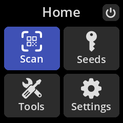

## Seeds

Seeds live in RAM only, power off and they are gone, that is by design. You can keep several seeds loaded in one session, each identified by its fingerprint.

From Seeds > (your seed) you get the per-seed menu:

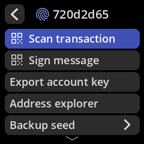

- **Scan transaction / Sign message**: same as scanning from the main menu, but pre-selects this seed.
- **Export account key**: shows the CIP-1852 account xpub as an animated QR for the host wallet. With the default settings only account 0 is exportable; if a host asks for other accounts the device refuses unless you enable Settings > Multi accounts. This gate exists for a reason: funds sent to a non-standard account index are invisible to a normal wallet restore, so we dont let a host talk you into one silently.
- **Address explorer**: derive and inspect your payment addresses, stake address and DRep ID on-device. Useful to confirm a receiving address a wallet shows you really belongs to your seed.
- **Backup seed**: view the words again or export a SeedQR / CompactSeedQR for [hand transcription](seed_qr/README.md).
- **Discard seed**: wipes it from memory immediately.

## Signing a transaction

The host wallet displays the request as an animated QR (`cardano-tx-sig-req`), you scan it, review, approve, and the device answers with another animated QR carrying the witness set. The host never learns anything but the signatures.

The flow is: **Overview** > **sequential review** > **summary** > **sign**.

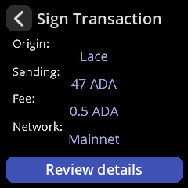 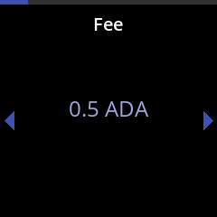

The overview tells you what kind of transaction this is and flags anything unusual. The sequential review then walks left/right through one page per item for every field present in the body: outputs, fee, validity window, certificates, withdrawals, mints and burns, collateral, required signers, votes, governance proposals, treasury moves, all of it. Nothing in the body is skipped, if a section exists you will page through it.

### Reading the badges

- **Address (Own) + Verified Address** (green): the host claimed this output is your change, the device re-derived the address from your seed and it matched. Own outputs dont count towards what you are spending.
- **Address (Foreign)** (red): everything else, including change claims that failed verification. Safe failure mode: a bad claim inflates what you appear to be sending, it never hides anything.
- **Own Key / Unknown Key**: shown under certificate credentials, required signers and DRep voters, based on key hashes derived from your seed.
- **Own Reward Account / Unknown Reward Account**: same idea for withdrawals.

### Native tokens

Tokens are identified by their CIP-14 fingerprint (`asset1...`). For a curated list of well known assets the device also shows the ticker, the properly scaled amount and a green Verified badge:

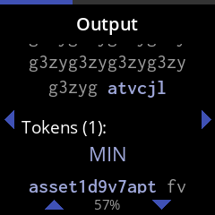 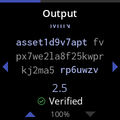

The fingerprint stays visible even for verified assets, a name can be registered by anyone, the fingerprint cannot be faked. Anything not on the list shows the raw integer amount plus an "Unknown decimals" warning, so a token with 6 decimals will look a million times bigger than it is. Thats expected, when in doubt check the fingerprint against a chain explorer.

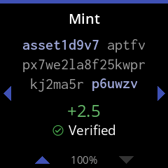 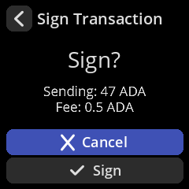

If the request is inconsistent (for example the transaction body declares mainnet but the request says testnet) the device rejects it before review with the exact reason, no signing possible.

## Signing a message (CIP-8)

Same trust model, three review screens: an overview (who is asking, what credential type, payload preview), the full signing credential, and the full payload (rendered as text when printable, hex otherwise).

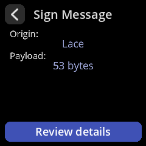 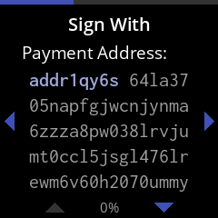 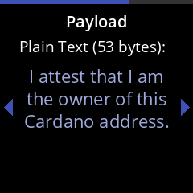

The credential screen is classified by what the key actually is, not by what the host says: a payment path shows a payment address, a stake path shows the stake address, a DRep path shows the CIP-129 `drep1...` ID. The device also refuses to sign if the address in the request isnt actually controlled by the requested signing path, so a host cannot show you one credential and bind the signature to another.

The signature comes back as COSE (the same wire format Ledger and Keystone produce), verifiable by Lace and CIP-95 dApps.

## Settings that matter

| Setting | Why you would touch it |
|---|---|
| Persist settings | Keep configuration across reboots on the SD card. Never stores seeds. |
| Multi accounts | Off by default. Enables browsing/exporting accounts other than 0. Read the warning above before enabling. |
| Multi credentials | Off by default. Non-standard stake/DRep indices in the explorer. |
| QR density | Lower it if your host webcam struggles with the animated QR. |
| Compact SeedQR | Smaller binary SeedQRs for backups. |
| Privacy / dire warnings | The caution screens before key export and seed display. Leave them on unless they really bother you. |
| Camera rotation | If your scan preview is upside down. |
| Display type / Invert colors | Panel hardware selection. |

## Updating

Updates are full image releases, there is no on-device updater (nothing on the device can write to itself, which is how it should be). Download the new image, verify the signature like the first time, flash the SD card again. Seeds are not stored on the device so there is nothing to migrate, just re-load your seed after the update.
